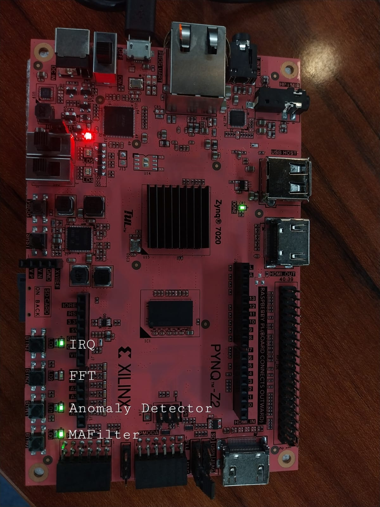
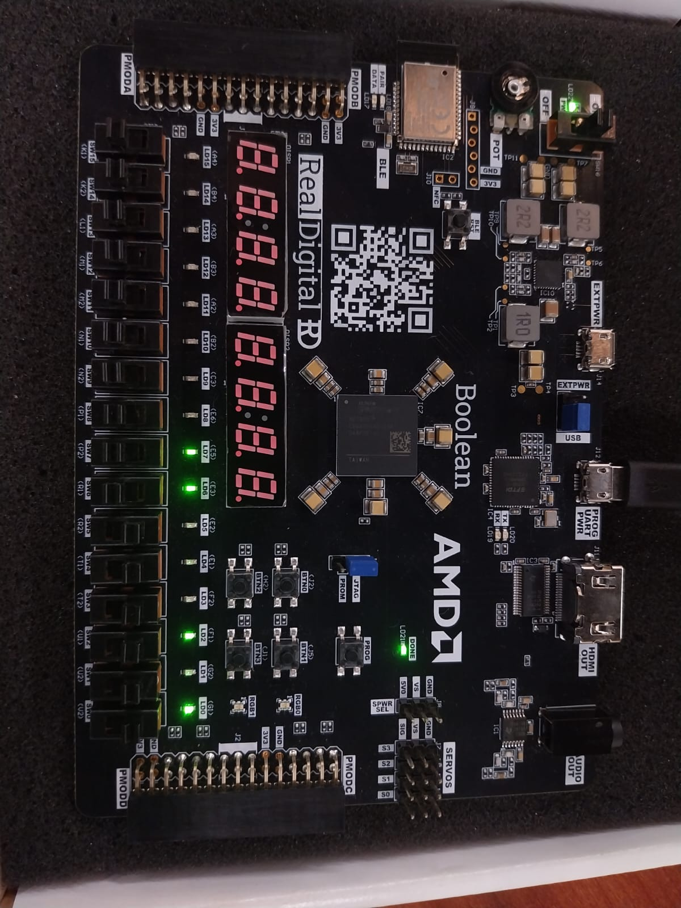

# FPGA-Based Edge Analytics IP Core

> A fully synthesizable, AXI4-Stream-compatible Edge Analytics IP implemented and verified on both the **PYNQ-Z2 (Zynq-7020)** and **RealDigital Boolean (Spartan-7)** FPGA platforms. Performs real-time signal processing, statistical feature extraction, FFT analysis, anomaly detection, and ML feature vector assembly — entirely in RTL.

---

## Table of Contents

- [Overview](#overview)
- [Architecture](#architecture)
- [Sub-modules](#sub-modules)
- [Signal Pipeline](#signal-pipeline)
- [Top-Level I/O](#top-level-io)
- [FPGA Verification](#fpga-verification)
- [Simulation](#simulation)
- [Repository Structure](#repository-structure)
- [Tools & Platform](#tools--platform)
- [Results](#results)
- [Authors](#authors)

---

## Overview

This project implements a **configurable Edge Analytics IP Core** capable of performing the full sensor-to-decision pipeline on an FPGA without any CPU involvement. The IP is designed for deployment in IoT edge nodes, industrial monitoring systems, and embedded ML inference pipelines.

**Key capabilities:**
- Real-time moving average filtering at 100 MHz
- Time-domain statistical feature extraction (7 features per window)
- Simplified radix-2 FFT engine (16–128 point, configurable)
- Threshold-based anomaly detection with hysteresis and severity grading
- 4-state decision FSM with dwell-time control
- 16-word ML feature vector assembly with AXI4 DMA write-out
- AXI4-Stream input + AXI4 master output interface

---

## Architecture

```
AXI4-Stream Input / Stimulus Generator
            │
            ▼
    ┌──────────────┐
    │  MA Filter   │  ──────────────────────────────────────────┐
    └──────────────┘                                            │
            │                                                   │
            ▼                                                   ▼
    ┌──────────────────┐     ┌──────────────┐     ┌───────────────────┐
    │  Feature         │────▶│  Anomaly     │────▶│  Decision Engine  │
    │  Extractor       │     │  Detector    │     │  (FSM)            │
    └──────────────────┘     └──────────────┘     └───────────────────┘
            │                                               │
            ▼                                               ▼
    ┌──────────────┐                          ┌────────────────────────┐
    │  FFT Engine  │                          │  ML Feature Vec (DMA)  │
    └──────────────┘                          └────────────────────────┘
                                                         │
                                                 AXI4 Master ──▶ DRAM
```

---

## Sub-modules

| Module | File | Description |
|---|---|---|
| `ea_top` | `rtl/ea_top.v` | Top-level integration module |
| `ea_stim_gen` | `rtl/ea_stim_gen.v` | Configurable stimulus generator (ramp / sine / spike / noise) |
| `ea_ma_filter` | `rtl/ea_ma_filter.v` | Pipelined moving average filter with bypass and runtime reconfiguration |
| `ea_feature_ext` | `rtl/ea_feature_ext.v` | 7-feature time-domain extractor (mean, variance, peak, RMS, ZCR, crest factor, shape factor) |
| `ea_fft_engine` | `rtl/ea_fft_engine.v` | Simplified radix-2 FFT with spectral centroid and fundamental bin detection |
| `ea_anomaly` | `rtl/ea_anomaly.v` | Hysteresis-based anomaly detector with z-score and severity grading |
| `ea_decision` | `rtl/ea_decision.v` | 4-state decision FSM (NORMAL → WARNING → ALERT → CRITICAL) with dwell counter |
| `ea_ml_fvec` | `rtl/ea_ml_fvec.v` | 16-word ML feature vector assembler with AXI4-bursting DMA writer |

---

## Signal Pipeline

```
Sensor Data ──▶ MA Filter ──▶ Feature Extractor ──▶ Anomaly Detector
                                    │                      │
                                FFT Engine          Decision Engine
                                    │                      │
                                    └──────────────────────┘
                                                │
                                        ML Feature Vector
                                                │
                                        AXI4 DMA Write ──▶ DRAM
```

Each stage asserts a `*_valid` handshake signal. The IRQ output is a registered OR of `feat_valid | anom_flag | fft_done | ml_ready | dec_valid`.

---

## Top-Level I/O

### Key Parameters

| Parameter | Default | Description |
|---|---|---|
| `DATA_W` | 16 | Sample data width (bits) |
| `FEAT_W` | 32 | Feature output width (bits) |
| `MAX_WIN_LOG` | 5 | Log2 of maximum MA/feature window size |
| `FFT_MAX_LOG` | 7 | Log2 of maximum FFT size (128 points) |
| `SPIKE_PERIOD` | 256 | Period of spike injection in stim gen |

### Interface Summary

| Interface | Direction | Description |
|---|---|---|
| `clk_i / rst_ni` | Input | System clock and active-low reset |
| `s_axis_t*` | Input | AXI4-Stream sensor data input |
| `ctrl_*_en_i` | Input | Per-block enable controls |
| `stim_mode_i [1:0]` | Input | Stimulus mode: ramp / sine / spike+sine / noise |
| `threshold_i` | Input | Anomaly detection threshold |
| `filt_data_o / filt_valid_o` | Output | Filtered sample stream |
| `feat_*_o / feat_valid_o` | Output | Feature vector outputs |
| `fft_*_o / fft_done_o` | Output | FFT spectral outputs |
| `anom_flag_o / anom_severity_o` | Output | Anomaly detection results |
| `dec_state_o / dec_valid_o` | Output | Decision FSM state |
| `m_axi_*` | Output | AXI4 master DMA interface |
| `irq_o` | Output | Registered interrupt output |

---

## FPGA Verification

The IP was implemented and verified on two FPGA platforms.

### PYNQ-Z2 (Xilinx Zynq-7020)

The PYNQ-Z2 exposes 4 LEDs (`led0`–`led3`). Each LED is mapped to a pipeline block status signal, and blocks were enabled incrementally to confirm correct operation.

| LED | Mapped Signal | Behavior | Status |
|---|---|---|---|
| `led0` | MA Filter active | Steady ON — filter continuously processing samples | ✅ Confirmed |
| `led1` | Feature extractor valid | Dim — pulsing once per window (low duty cycle) | ✅ Confirmed |
| `led2` | Anomaly flag | Steady ON — ramp signal exceeds threshold | ✅ Confirmed |
| `led3` | FFT done | Dim — pulsing once per frame (~5–10% duty cycle) | ✅ Confirmed |

📷 *PYNQ-Z2 board running the Edge Analytics IP — LEDs confirming MA Filter, Anomaly Detector, FFT, and IRQ outputs:*



---

### Spartan-7 (RealDigital Boolean Board)

The full pipeline was verified on the **Spartan-7** board using 8 switches (`sw[0]`–`sw[7]`) to incrementally enable each block and 8 LEDs (`led[0]`–`led[7]`) to observe outputs in real time.

#### Switch-to-Block Mapping

| Switch | Block Enabled |
|---|---|
| `sw[0]` | MA Filter |
| `sw[1]` | Feature Extractor |
| `sw[2]` | Anomaly Detector |
| `sw[3]` | FFT Engine |
| `sw[4]` | Decision Engine + ML Feature Vector (full pipeline) |
| `sw[5]` | Amplitude select: 0 = default, 1 = 4000 |

#### LED Output — Full Pipeline (`sw[0]`–`sw[4]` all ON)

| LED | Mapped Signal | Behavior | What It Means |
|---|---|---|---|
| `led[0]` | MA Filter active | **Steady** | Filter continuously reading samples at 100 MHz |
| `led[1]` | Feature extractor valid | **Dim** (~12% duty cycle) | Extractor pulsing once every 8 samples |
| `led[2]` | Anomaly flag | **Steady** | Ramp crossed threshold; hysteresis holds it latched ON |
| `led[3]` | FFT done | **Dim** (~5–10% duty cycle) | FFT completing one frame periodically |
| `led[4]` | Decision valid | **Dim** | FSM outputting `dec_valid` once per feature window |
| `led[5]` | ML vector ready | **Dim** | DMA completing one 16-word burst per feature window |
| `led[6]` | Decision state bit 0 | **Steady** | FSM in CRITICAL state (`dec_state = 2'b11`, bit 0 = 1) |
| `led[7]` | IRQ | **Steady** | IRQ latched HIGH — `anom_flag` continuously asserted |

**Decision FSM progression observed:** `NORMAL → WARNING → ALERT → CRITICAL` under sustained ramp anomaly.

#### What Each LED Tells You

| Step | LED(s) | What's Happening |
|---|---|---|
| 1 | `led[0]` | Reading sensor data continuously |
| 2 | `led[1]` | Extracting features every few samples |
| 3 | `led[2]` | Dangerous condition detected and held |
| 4 | `led[3]` | Performing frequency analysis |
| 5 | `led[4]` + `led[6]` | Decision made — system in CRITICAL state |
| 6 | `led[5]` | Feature data ready for ML / DMA transfer |
| 7 | `led[7]` | System-wide IRQ raised |

📷 *Spartan-7 board running the full 7-stage Edge Analytics pipeline:*



---

## Simulation

Simulated using **Cadence NC-Launch** (ncsim).

All sub-modules were verified independently before integration:

- `ea_ma_filter` — continuous stream at 100 MHz
- `ea_feature_ext` — window accumulation and pulse on `feat_valid`
- `ea_fft_engine` — frame collection, butterfly computation, `done_o` pulse
- `ea_anomaly` — hysteresis, severity levels, z-score proxy
- `ea_decision` — 4-state FSM with dwell counter
- `ea_ml_fvec` — AXI4 burst write with correct WLAST timing

---

## Repository Structure

```
edge_analytics_ip/
├── rtl/
│   ├── ea_top.v              # Top-level integration
│   ├── ea_stim_gen.v         # Stimulus generator
│   ├── ea_ma_filter.v        # Moving average filter
│   ├── ea_feature_ext.v      # Feature extractor
│   ├── ea_fft_engine.v       # FFT engine
│   ├── ea_anomaly.v          # Anomaly detector
│   ├── ea_decision.v         # Decision FSM
│   └── ea_ml_fvec.v          # ML feature vector + DMA
├── sim/
│   ├── tb_ea_top.v           # Top-level testbench (Cadence)
│   └── nclaunch_sim/
│       ├── sim1.jpeg         # Simulation waveform 1
│       ├── sim2.jpeg         # Simulation waveform 2
│       └── sim3.jpeg         # Simulation waveform 3
├── genus/
|   ├── reports/
│       ├── ea_top_area.rpt   # Post-synthesis gate count and resource 
│       ├── ea_top_timing.rpt # Setup/hold slack reports (pre-layout)
│       └── ea_top_power.rpt  # Dynamic and leakage power estimates
|    └── synthesize.tcl       # Genus synthesis script — reads RTL, applies constraints, and exports netlist
├── innovus/
|    └── implementation.png   # GDSII
├── constraints/
│   ├── pynq_z2.xdc           # PYNQ-Z2 pin constraints
│   ├── spartan7.xdc          # Spartan-7 pin constraints
├── docs/
│   ├── IP.png                # Block design
│   ├── architecture.png      # Block diagram
│   ├── spartan7.jpeg         # Spartan-7 board implementation
│   └── pynq_z2.jpeg          # PYNQ-Z2 board implementation
├── README.md
```

---

## Tools & Platform

| Tool / Platform | Details |
|---|---|
| **Primary FPGA Board** | PYNQ-Z2 (Xilinx Zynq-7020) |
| **Secondary FPGA Board** | Spartan-7 (XC7S series) |
| **Synthesis & Implementation** | Xilinx Vivado |
| **Simulation** | Cadence NC-Launch (ncsim) |
| **Synthesis** | Cadence Genus |
| **GDSII** | Cadence Innovus |
| **HDL** | Verilog (synthesizable RTL, no vendor primitives) |
| **Target Clock** | 100 MHz |
| **AXI Interface** | AXI4-Stream (slave) + AXI4 (master, DMA) |
| **Cross-platform** | RTL is portable across Xilinx 7-series (Zynq-7000, Spartan-7, Artix-7) |

---

## Results

- All 7 pipeline stages verified on hardware via LED indicators on PYNQ-Z2
- Successfully synthesized and implemented on Spartan-7 — confirming portability across Xilinx 7-series
- Decision FSM correctly escalates from NORMAL through CRITICAL under sustained ramp anomaly
- FFT engine correctly computes fundamental bin, DC magnitude, and spectral centroid
- AXI4 DMA writer correctly bursts 16-word feature vector with proper WLAST handshaking
- MA filter operates at full 100 MHz throughput with runtime reconfigurable window size
- No board-specific primitives used — RTL is synthesizable across Zynq-7000, Spartan-7, and Artix-7

---

## Authors

> **Capstone Project** — *Saveetha Engineering College, 2026*

| Name | Roll No. | Department |
|---|---|---|
| SRINIDHI S | 212223060272 | Electronics & Communication Engineering |
| RESHMI S | 212223060224 | Electronics & Communication Engineering |

---

## License

This project is licensed under the MIT License. See [LICENSE](LICENSE) for details.
